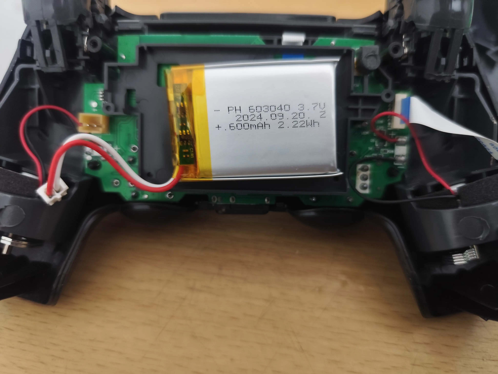
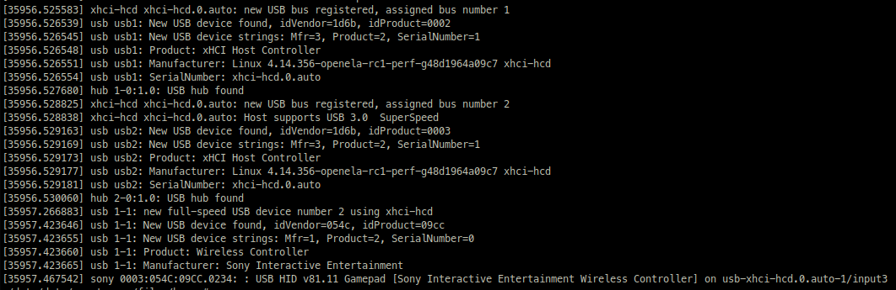
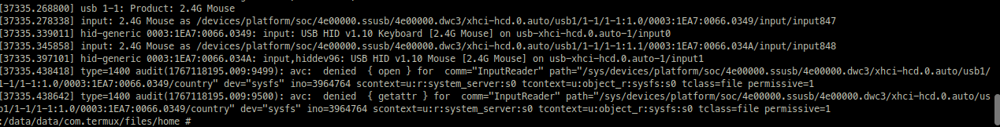
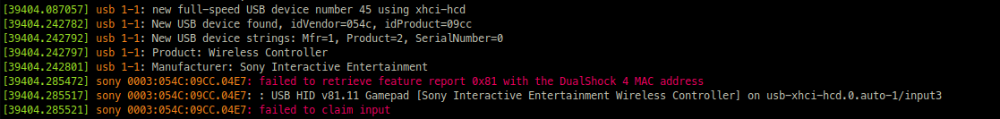
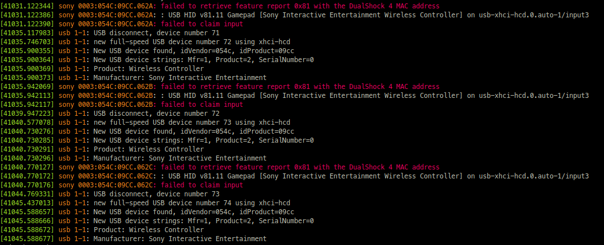
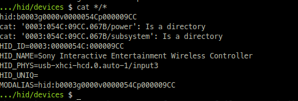
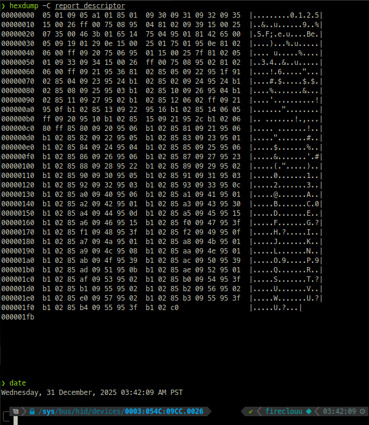

# Android USB HID support for Dualshock 4 (a research Work-in-progress)
Reverse-engineering study of how android handles USB HID connection with my personal Dualshock 4 controller

# I made it fun to read!
Yes. I think. English is not my native language so there will be incorrect usage of words, prepositions, etc. and it might sound written in simple english, cause it is and my vocabulary is limited. I'll consult AI later for these, but for now, here is my full, non-translated grammar.

# Motivation
Android native support for controllers mostly uses bluetooth, my DS4 battery is dying as of writing this README, it sucks to know my phone, Xiaomi Redmi series running `Android 15 build AQ3A.240912.001` or its kernel compiled won't work with USB. I want challenge, and i'll try to understand DS4's driver, and maybe write something that may benefit the community.

# Device
## Controller
I purchased fake one, f*ck i'm poor. It's PS4 OEM, still I want these to work with me, so here are the details:
`DS4 CUH-ZCT2E Wireless Controller` as per written on the back of it




Note that I am aware that I can purchase battery online, I chose not to and try hard mode.

## Android device/s
My daily driver phone i'm using is `Xiaomi Redmi Note 13 Pro 5G` which is bootloader-locked as of writing, and I have no intention for now to break it due to stuffs relate to office and bank transaction. Those apps hates android's `Developer mode` turned on too :( 

So I end up using my other phone `Redmi Note 8` (we will call it `RN8` up to this point) with `LineageOS 22.2-20250618` running `Android 15` and this is a `rooted` phone so I can easily tinker with its USB bus capabilities relying on `Android SDK` just to read USB content, and also I'm afraid those `API` may be limited for us to use. We will be using official SDK later, if possible on these project, but for now, we take easier route.

# Preparation
To make it easier for me, I'm using `Termux` and its compiled binaries available for `root` operations. Also, thanks to `ssh` I can just work with my PC seamlessly without too much of wired connection to the device `RN8`.

# Findings
Let's enumerate USB devices connected by doing `dmesg | grep -i usb`


I don't know much of the output but I do know near the last line our fake controller is being read. It even replicates the manufacturer, identified as Sony-produced device.

Other helpful information we extracted here is:
`0003:054C:09CC.0234`

This is identifier. Lets decode.

`03h` means its a *HIDclass*, refer [here](https://learn.microsoft.com/en-us/windows-hardware/drivers/usbcon/supported-usb-classes)

`054Ch` means our vendor is *Sony Group Corporation*, refer [here](https://the-sz.com/products/usbid/index.php?v=054C&p=&n=)

`09CCh` means the product ID (PID) is our lovely mocked *Dualshock4 [CUH-ZCT2x]*, refer [here](https://the-sz.com/products/usbid/index.php?v=054C&p=&n=)

the last `0234h` is my device's kernel which identifies it as its unique ID.

TL;DR: my fake controller is being read on USB bus as Sony-produced wireless controller

## If that's the case, then why not android makes use of it? why mouse, also a HIDclass, being read but DS4 don't?
That's what I tell to myself too. So I plug another HIDclass USB and found these:


> storytime first. I just got these mouse (the one on the screenshot) from a buy and sell page, and I just found out that it should also bundled with a keyboard too. But it was given to me for free, but doing these report I uncover that it should be a combo device haha.

Now then, dmesg reads it as keyboard/mouse HID, but how did android decided that...
> Android: hey this is a keyboard and mouse, i will consume your inputs and be useful

Android, or its kernel which is linux-based, reports the USB plugged in as `Product: 2.4G Mouse` together with the vendor and product ID of which we have done it above and you can do so for yourself on this device if you want.

But again, how did android decide that a HID is consumable? I tried full dmesg, and this is where I uncover what android wants to tell me in the first place

Plugging DS4 Controller 


Side note: Android **is very determined to read these HID** since it loops on reading it as soon as it fails to read. I took notice of it too physically since the **controller** won't stop the light flashing, I thought maybe android just charging its battery as soon as it fails, but nope! You can see the evidence here:



Setting aside about mouse and keyboard problem (we should come back to these later on), first lets focus on the line where it says:

<span style='font-family: monospace; background: #000000'>
<span style='color: green;'>[39975.372406]</span> <span style='color: orange;'>sony 0003:054C:09CC.0558:</span> <span style='color: red;'>failed to retrieve feature report 0x81 with the DualShock 4 MAC address</span>
</span>

...*feature report*, huh?

Before we understand anything of these, some knowledge with USB devices, in our case USB HID, is a must and thankfully [docs.kernel.org's USB HID RD](https://docs.kernel.org/hid/hidintro.html) exist.

Reading the docs, to be able to make sense of these report, a `report_descriptor` must be extracted to USB HID, but remember that android likes to reconnect continuously? I need to get the data as FAST AS POSSIBLE before android redo the connection, as the ID increments on every attempt, so I just did `cat */*`



The `report_descriptor` appears not to load here. Let's try my x64 linux machine:



> Oh hey, tomorrow is 2026!

Gotcha! Now, what does this do then? based on [docs.kernel.org](https://docs.kernel.org/hid/hidintro.html) it is recommended to use existing parser. Thankfully there is an online one, so i just need to `hexdump -e '16/1 "%02x " "\n"' report_descriptor` and paste it on [USB Descriptor and Request parser page](https://eleccelerator.com/usbdescreqparser/) and parse it as **USB HID RD**:
```
0x05, 0x01,        // Usage Page (Generic Desktop Ctrls)
0x09, 0x05,        // Usage (Game Pad)
0xA1, 0x01,        // Collection (Application)
0x85, 0x01,        //   Report ID (1)
0x09, 0x30,        //   Usage (X)
0x09, 0x31,        //   Usage (Y)
0x09, 0x32,        //   Usage (Z)
0x09, 0x35,        //   Usage (Rz)
0x15, 0x00,        //   Logical Minimum (0)
0x26, 0xFF, 0x00,  //   Logical Maximum (255)
0x75, 0x08,        //   Report Size (8)
0x95, 0x04,        //   Report Count (4)
0x81, 0x02,        //   Input (Data,Var,Abs,No Wrap,Linear,Preferred State,No Null Position)
0x09, 0x39,        //   Usage (Hat switch)
0x15, 0x00,        //   Logical Minimum (0)
0x25, 0x07,        //   Logical Maximum (7)
0x35, 0x00,        //   Physical Minimum (0)
0x46, 0x3B, 0x01,  //   Physical Maximum (315)
0x65, 0x14,        //   Unit (System: English Rotation, Length: Centimeter)
0x75, 0x04,        //   Report Size (4)
0x95, 0x01,        //   Report Count (1)
0x81, 0x42,        //   Input (Data,Var,Abs,No Wrap,Linear,Preferred State,Null State)
0x65, 0x00,        //   Unit (None)
0x05, 0x09,        //   Usage Page (Button)
0x19, 0x01,        //   Usage Minimum (0x01)
0x29, 0x0E,        //   Usage Maximum (0x0E)
0x15, 0x00,        //   Logical Minimum (0)
0x25, 0x01,        //   Logical Maximum (1)
0x75, 0x01,        //   Report Size (1)
0x95, 0x0E,        //   Report Count (14)
0x81, 0x02,        //   Input (Data,Var,Abs,No Wrap,Linear,Preferred State,No Null Position)
0x06, 0x00, 0xFF,  //   Usage Page (Vendor Defined 0xFF00)
0x09, 0x20,        //   Usage (0x20)
0x75, 0x06,        //   Report Size (6)
0x95, 0x01,        //   Report Count (1)
0x15, 0x00,        //   Logical Minimum (0)
0x25, 0x7F,        //   Logical Maximum (127)
0x81, 0x02,        //   Input (Data,Var,Abs,No Wrap,Linear,Preferred State,No Null Position)
0x05, 0x01,        //   Usage Page (Generic Desktop Ctrls)
0x09, 0x33,        //   Usage (Rx)
0x09, 0x34,        //   Usage (Ry)
0x15, 0x00,        //   Logical Minimum (0)
0x26, 0xFF, 0x00,  //   Logical Maximum (255)
0x75, 0x08,        //   Report Size (8)
0x95, 0x02,        //   Report Count (2)
0x81, 0x02,        //   Input (Data,Var,Abs,No Wrap,Linear,Preferred State,No Null Position)
0x06, 0x00, 0xFF,  //   Usage Page (Vendor Defined 0xFF00)
0x09, 0x21,        //   Usage (0x21)
0x95, 0x36,        //   Report Count (54)
0x81, 0x02,        //   Input (Data,Var,Abs,No Wrap,Linear,Preferred State,No Null Position)
0x85, 0x05,        //   Report ID (5)
0x09, 0x22,        //   Usage (0x22)
0x95, 0x1F,        //   Report Count (31)
0x91, 0x02,        //   Output (Data,Var,Abs,No Wrap,Linear,Preferred State,No Null Position,Non-volatile)
0x85, 0x04,        //   Report ID (4)
0x09, 0x23,        //   Usage (0x23)
0x95, 0x24,        //   Report Count (36)
0xB1, 0x02,        //   Feature (Data,Var,Abs,No Wrap,Linear,Preferred State,No Null Position,Non-volatile)
0x85, 0x02,        //   Report ID (2)
0x09, 0x24,        //   Usage (0x24)
0x95, 0x24,        //   Report Count (36)
0xB1, 0x02,        //   Feature (Data,Var,Abs,No Wrap,Linear,Preferred State,No Null Position,Non-volatile)
0x85, 0x08,        //   Report ID (8)
0x09, 0x25,        //   Usage (0x25)
0x95, 0x03,        //   Report Count (3)
0xB1, 0x02,        //   Feature (Data,Var,Abs,No Wrap,Linear,Preferred State,No Null Position,Non-volatile)
0x85, 0x10,        //   Report ID (16)
0x09, 0x26,        //   Usage (0x26)
0x95, 0x04,        //   Report Count (4)
0xB1, 0x02,        //   Feature (Data,Var,Abs,No Wrap,Linear,Preferred State,No Null Position,Non-volatile)
0x85, 0x11,        //   Report ID (17)
0x09, 0x27,        //   Usage (0x27)
0x95, 0x02,        //   Report Count (2)
0xB1, 0x02,        //   Feature (Data,Var,Abs,No Wrap,Linear,Preferred State,No Null Position,Non-volatile)
0x85, 0x12,        //   Report ID (18)
0x06, 0x02, 0xFF,  //   Usage Page (Vendor Defined 0xFF02)
0x09, 0x21,        //   Usage (0x21)
0x95, 0x0F,        //   Report Count (15)
0xB1, 0x02,        //   Feature (Data,Var,Abs,No Wrap,Linear,Preferred State,No Null Position,Non-volatile)
0x85, 0x13,        //   Report ID (19)
0x09, 0x22,        //   Usage (0x22)
0x95, 0x16,        //   Report Count (22)
0xB1, 0x02,        //   Feature (Data,Var,Abs,No Wrap,Linear,Preferred State,No Null Position,Non-volatile)
0x85, 0x14,        //   Report ID (20)
0x06, 0x05, 0xFF,  //   Usage Page (Vendor Defined 0xFF05)
0x09, 0x20,        //   Usage (0x20)
0x95, 0x10,        //   Report Count (16)
0xB1, 0x02,        //   Feature (Data,Var,Abs,No Wrap,Linear,Preferred State,No Null Position,Non-volatile)
0x85, 0x15,        //   Report ID (21)
0x09, 0x21,        //   Usage (0x21)
0x95, 0x2C,        //   Report Count (44)
0xB1, 0x02,        //   Feature (Data,Var,Abs,No Wrap,Linear,Preferred State,No Null Position,Non-volatile)
0x06, 0x80, 0xFF,  //   Usage Page (Vendor Defined 0xFF80)
0x85, 0x80,        //   Report ID (-128)
0x09, 0x20,        //   Usage (0x20)
0x95, 0x06,        //   Report Count (6)
0xB1, 0x02,        //   Feature (Data,Var,Abs,No Wrap,Linear,Preferred State,No Null Position,Non-volatile)
0x85, 0x81,        //   Report ID (-127)
0x09, 0x21,        //   Usage (0x21)
0x95, 0x06,        //   Report Count (6)
0xB1, 0x02,        //   Feature (Data,Var,Abs,No Wrap,Linear,Preferred State,No Null Position,Non-volatile)
0x85, 0x82,        //   Report ID (-126)
0x09, 0x22,        //   Usage (0x22)
0x95, 0x05,        //   Report Count (5)
0xB1, 0x02,        //   Feature (Data,Var,Abs,No Wrap,Linear,Preferred State,No Null Position,Non-volatile)
0x85, 0x83,        //   Report ID (-125)
0x09, 0x23,        //   Usage (0x23)
0x95, 0x01,        //   Report Count (1)
0xB1, 0x02,        //   Feature (Data,Var,Abs,No Wrap,Linear,Preferred State,No Null Position,Non-volatile)
0x85, 0x84,        //   Report ID (-124)
0x09, 0x24,        //   Usage (0x24)
0x95, 0x04,        //   Report Count (4)
0xB1, 0x02,        //   Feature (Data,Var,Abs,No Wrap,Linear,Preferred State,No Null Position,Non-volatile)
0x85, 0x85,        //   Report ID (-123)
0x09, 0x25,        //   Usage (0x25)
0x95, 0x06,        //   Report Count (6)
0xB1, 0x02,        //   Feature (Data,Var,Abs,No Wrap,Linear,Preferred State,No Null Position,Non-volatile)
0x85, 0x86,        //   Report ID (-122)
0x09, 0x26,        //   Usage (0x26)
0x95, 0x06,        //   Report Count (6)
0xB1, 0x02,        //   Feature (Data,Var,Abs,No Wrap,Linear,Preferred State,No Null Position,Non-volatile)
0x85, 0x87,        //   Report ID (-121)
0x09, 0x27,        //   Usage (0x27)
0x95, 0x23,        //   Report Count (35)
0xB1, 0x02,        //   Feature (Data,Var,Abs,No Wrap,Linear,Preferred State,No Null Position,Non-volatile)
0x85, 0x88,        //   Report ID (-120)
0x09, 0x28,        //   Usage (0x28)
0x95, 0x22,        //   Report Count (34)
0xB1, 0x02,        //   Feature (Data,Var,Abs,No Wrap,Linear,Preferred State,No Null Position,Non-volatile)
0x85, 0x89,        //   Report ID (-119)
0x09, 0x29,        //   Usage (0x29)
0x95, 0x02,        //   Report Count (2)
0xB1, 0x02,        //   Feature (Data,Var,Abs,No Wrap,Linear,Preferred State,No Null Position,Non-volatile)
0x85, 0x90,        //   Report ID (-112)
0x09, 0x30,        //   Usage (0x30)
0x95, 0x05,        //   Report Count (5)
0xB1, 0x02,        //   Feature (Data,Var,Abs,No Wrap,Linear,Preferred State,No Null Position,Non-volatile)
0x85, 0x91,        //   Report ID (-111)
0x09, 0x31,        //   Usage (0x31)
0x95, 0x03,        //   Report Count (3)
0xB1, 0x02,        //   Feature (Data,Var,Abs,No Wrap,Linear,Preferred State,No Null Position,Non-volatile)
0x85, 0x92,        //   Report ID (-110)
0x09, 0x32,        //   Usage (0x32)
0x95, 0x03,        //   Report Count (3)
0xB1, 0x02,        //   Feature (Data,Var,Abs,No Wrap,Linear,Preferred State,No Null Position,Non-volatile)
0x85, 0x93,        //   Report ID (-109)
0x09, 0x33,        //   Usage (0x33)
0x95, 0x0C,        //   Report Count (12)
0xB1, 0x02,        //   Feature (Data,Var,Abs,No Wrap,Linear,Preferred State,No Null Position,Non-volatile)
0x85, 0xA0,        //   Report ID (-96)
0x09, 0x40,        //   Usage (0x40)
0x95, 0x06,        //   Report Count (6)
0xB1, 0x02,        //   Feature (Data,Var,Abs,No Wrap,Linear,Preferred State,No Null Position,Non-volatile)
0x85, 0xA1,        //   Report ID (-95)
0x09, 0x41,        //   Usage (0x41)
0x95, 0x01,        //   Report Count (1)
0xB1, 0x02,        //   Feature (Data,Var,Abs,No Wrap,Linear,Preferred State,No Null Position,Non-volatile)
0x85, 0xA2,        //   Report ID (-94)
0x09, 0x42,        //   Usage (0x42)
0x95, 0x01,        //   Report Count (1)
0xB1, 0x02,        //   Feature (Data,Var,Abs,No Wrap,Linear,Preferred State,No Null Position,Non-volatile)
0x85, 0xA3,        //   Report ID (-93)
0x09, 0x43,        //   Usage (0x43)
0x95, 0x30,        //   Report Count (48)
0xB1, 0x02,        //   Feature (Data,Var,Abs,No Wrap,Linear,Preferred State,No Null Position,Non-volatile)
0x85, 0xA4,        //   Report ID (-92)
0x09, 0x44,        //   Usage (0x44)
0x95, 0x0D,        //   Report Count (13)
0xB1, 0x02,        //   Feature (Data,Var,Abs,No Wrap,Linear,Preferred State,No Null Position,Non-volatile)
0x85, 0xA5,        //   Report ID (-91)
0x09, 0x45,        //   Usage (0x45)
0x95, 0x15,        //   Report Count (21)
0xB1, 0x02,        //   Feature (Data,Var,Abs,No Wrap,Linear,Preferred State,No Null Position,Non-volatile)
0x85, 0xA6,        //   Report ID (-90)
0x09, 0x46,        //   Usage (0x46)
0x95, 0x15,        //   Report Count (21)
0xB1, 0x02,        //   Feature (Data,Var,Abs,No Wrap,Linear,Preferred State,No Null Position,Non-volatile)
0x85, 0xF0,        //   Report ID (-16)
0x09, 0x47,        //   Usage (0x47)
0x95, 0x3F,        //   Report Count (63)
0xB1, 0x02,        //   Feature (Data,Var,Abs,No Wrap,Linear,Preferred State,No Null Position,Non-volatile)
0x85, 0xF1,        //   Report ID (-15)
0x09, 0x48,        //   Usage (0x48)
0x95, 0x3F,        //   Report Count (63)
0xB1, 0x02,        //   Feature (Data,Var,Abs,No Wrap,Linear,Preferred State,No Null Position,Non-volatile)
0x85, 0xF2,        //   Report ID (-14)
0x09, 0x49,        //   Usage (0x49)
0x95, 0x0F,        //   Report Count (15)
0xB1, 0x02,        //   Feature (Data,Var,Abs,No Wrap,Linear,Preferred State,No Null Position,Non-volatile)
0x85, 0xA7,        //   Report ID (-89)
0x09, 0x4A,        //   Usage (0x4A)
0x95, 0x01,        //   Report Count (1)
0xB1, 0x02,        //   Feature (Data,Var,Abs,No Wrap,Linear,Preferred State,No Null Position,Non-volatile)
0x85, 0xA8,        //   Report ID (-88)
0x09, 0x4B,        //   Usage (0x4B)
0x95, 0x01,        //   Report Count (1)
0xB1, 0x02,        //   Feature (Data,Var,Abs,No Wrap,Linear,Preferred State,No Null Position,Non-volatile)
0x85, 0xA9,        //   Report ID (-87)
0x09, 0x4C,        //   Usage (0x4C)
0x95, 0x08,        //   Report Count (8)
0xB1, 0x02,        //   Feature (Data,Var,Abs,No Wrap,Linear,Preferred State,No Null Position,Non-volatile)
0x85, 0xAA,        //   Report ID (-86)
0x09, 0x4E,        //   Usage (0x4E)
0x95, 0x01,        //   Report Count (1)
0xB1, 0x02,        //   Feature (Data,Var,Abs,No Wrap,Linear,Preferred State,No Null Position,Non-volatile)
0x85, 0xAB,        //   Report ID (-85)
0x09, 0x4F,        //   Usage (0x4F)
0x95, 0x39,        //   Report Count (57)
0xB1, 0x02,        //   Feature (Data,Var,Abs,No Wrap,Linear,Preferred State,No Null Position,Non-volatile)
0x85, 0xAC,        //   Report ID (-84)
0x09, 0x50,        //   Usage (0x50)
0x95, 0x39,        //   Report Count (57)
0xB1, 0x02,        //   Feature (Data,Var,Abs,No Wrap,Linear,Preferred State,No Null Position,Non-volatile)
0x85, 0xAD,        //   Report ID (-83)
0x09, 0x51,        //   Usage (0x51)
0x95, 0x0B,        //   Report Count (11)
0xB1, 0x02,        //   Feature (Data,Var,Abs,No Wrap,Linear,Preferred State,No Null Position,Non-volatile)
0x85, 0xAE,        //   Report ID (-82)
0x09, 0x52,        //   Usage (0x52)
0x95, 0x01,        //   Report Count (1)
0xB1, 0x02,        //   Feature (Data,Var,Abs,No Wrap,Linear,Preferred State,No Null Position,Non-volatile)
0x85, 0xAF,        //   Report ID (-81)
0x09, 0x53,        //   Usage (0x53)
0x95, 0x02,        //   Report Count (2)
0xB1, 0x02,        //   Feature (Data,Var,Abs,No Wrap,Linear,Preferred State,No Null Position,Non-volatile)
0x85, 0xB0,        //   Report ID (-80)
0x09, 0x54,        //   Usage (0x54)
0x95, 0x3F,        //   Report Count (63)
0xB1, 0x02,        //   Feature (Data,Var,Abs,No Wrap,Linear,Preferred State,No Null Position,Non-volatile)
0x85, 0xB1,        //   Report ID (-79)
0x09, 0x55,        //   Usage (0x55)
0x95, 0x02,        //   Report Count (2)
0xB1, 0x02,        //   Feature (Data,Var,Abs,No Wrap,Linear,Preferred State,No Null Position,Non-volatile)
0x85, 0xB2,        //   Report ID (-78)
0x09, 0x56,        //   Usage (0x56)
0x95, 0x02,        //   Report Count (2)
0xB1, 0x02,        //   Feature (Data,Var,Abs,No Wrap,Linear,Preferred State,No Null Position,Non-volatile)
0x85, 0xE0,        //   Report ID (-32)
0x09, 0x57,        //   Usage (0x57)
0x95, 0x02,        //   Report Count (2)
0xB1, 0x02,        //   Feature (Data,Var,Abs,No Wrap,Linear,Preferred State,No Null Position,Non-volatile)
0x85, 0xB3,        //   Report ID (-77)
0x09, 0x55,        //   Usage (0x55)
0x95, 0x3F,        //   Report Count (63)
0xB1, 0x02,        //   Feature (Data,Var,Abs,No Wrap,Linear,Preferred State,No Null Position,Non-volatile)
0x85, 0xB4,        //   Report ID (-76)
0x09, 0x55,        //   Usage (0x55)
0x95, 0x3F,        //   Report Count (63)
0xB1, 0x02,        //   Feature (Data,Var,Abs,No Wrap,Linear,Preferred State,No Null Position,Non-volatile)
0xC0,              // End Collection

// 507 bytes
```

> upon extracting these, i just found out that [there exists a community-contributed HID descriptors](https://controllers.fandom.com/wiki/Sony_DualShock_4/HID_Descriptors) available! Nice!

**TOO MUCH DATA!!!**

It's confusing to me and I don't have knowledge with USB descriptors, up until now. We should ingest those information slowly.

I'm no stranger working with hexadecimal notations though. When writing my first emulator for `space invaders` which uses `intel 8080 cpu`, I exposed myself identifying memory addresses, instruction sets, and such. So, with these information above, having those knowledge really helps, well not most of those parts but the structure of what is parser outputted is.

What feature report are we failing again? Right, its `0x81` and the output tells us that:
```
...
0x85, 0x81,        //   Report ID (-127)
0x09, 0x21,        //   Usage (0x21)
0x95, 0x06,        //   Report Count (6)
0xB1, 0x02,        //   Feature (Data,Var,Abs,No Wrap,Linear,Preferred State,No Null Position,Non-volatile)
...
```

we can tell, again based on kernel.org, that this is a 'Feature' report, which is baked data on HID, and has `06h` data field, and what does a MAC address length for example?

`00:11:22:AA:BB:CC`

has six segments. We can assume this feature returns something related to MAC address due to the evidence on its RD, and thanks to community effort, upstream linux verifies that this feature **really is** returning a MAC address of the device. 

I have to be sure that Android kernel really understand Sony's HID feature request. Looking at [Android kernel source](https://android.googlesource.com/kernel/common.git/+/brillo-m9-release/drivers/hid/hid-sony.c) we can verify on line `1789 - 1792`:

```c
if (ret != 7) {
    hid_err(sc->hdev, "failed to retrieve feature report 0x81 with the DualShock 4 MAC address\n");
    return ret < 0 ? ret : -EINVAL;
}
```

same dmesg error appears here. 


Why is this *kernel-thingy* important to me? well I still don't have ideas about `drivers` in full context, at first I assume that those errors are directly coming from `HID`, in our case the DS4 OEM, communicating with android but I can't accept the fact that the manufacturer, Sony, exposing their secrets freely by telling which feature request is failing, it must be reversed-engineered by someone and [I was right on that point!](https://dsremap.readthedocs.io/en/latest/reverse.html)

## What's causing kernel driver on android's failed handoff then?


# Are we there yet?
Personally, there are things that is still not clear.
- How does android kernel handle failing HID?
  - Answer: android is strict. I still cannot prove it yet since my android experience working with low-level scenarios are limited, but we know how android operates and modifies their code for security purposes. I'll try to do my best though.
- Is newer `Android API` supports USB HID comms on userspace
  - Answer: web says **yes** but the limitation is what I'm thinking of.
- Do we need to patch the kernel?
  - Answer: **yes?** if that is the case then I'm f*cked, firstly I still don't touch kernel code, heck I don't know how to build simple one (but I wanna learn), and with the resource I have right now, compiling Android kernel seems to be a slow path to me.
  - And also, if it is a **kernel-based solution**, how can I transfer that to my daily driver then? I think if that's the case then we'll wait for android to just do their magic then.
- How do you intend to do it?
  - Answer: **trial and error method**, on technical side, I'm prepping myself to write basic magisk module that will do these if possible, or modify `hid-sony.c` code i don't really know at this point in time.

# Conclusion
I admit some of what I talked about here may not be accurate or completely incorrect. I appreciate community to discuss which part I fail and I'll respond as soon as possible!

This is still a work-in-progress project I may or may not continue, depending on my mood and how life becomes for me. If you want to get in touch, use my email provided on profile, or invite me around Metro Manila, PH. I would love to talk and shed some ideas!

# Resources
- [kernel.org USB HID Report Descriptors](https://docs.kernel.org/hid/hidintro.html#output-input-and-feature-reports)
- [torvalds/linux](https://github.com/torvalds/linux/tree/master)
- [Game Controller Collective Wiki](https://controllers.fandom.com/wiki/Sony_DualShock_4)
- [dsremap](https://dsremap.readthedocs.io/en/latest/reverse.html)
- [Android kernel overview | AOSP](https://source.android.com/docs/core/architecture/kernel)
- [Android source code](https://android.googlesource.com/kernel/common.git/+/brillo-m9-release/drivers/hid/hid-sony.c)
- [the sz development for USB ID database](https://the-sz.com/products/usbid/)
- [DS4 Pairing | Playstation](https://www.playstation.com/en-us/support/hardware/ps4-pair-dualshock-4-wireless-with-pc-or-mac/)
- [USB descriptor and request parser | eleccelerator.com](https://eleccelerator.com/usbdescreqparser/)

> !NOTE
> I'm writing these the day before 2026 arrive! Happy new year all!